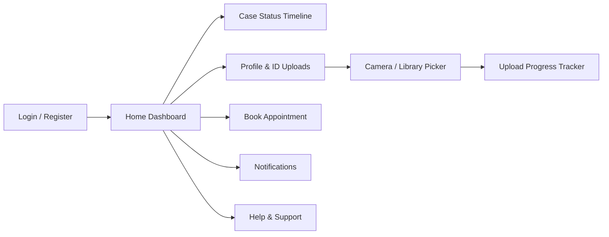

<div align="center">


<a href="https://github.com">
  
</a>

<br/>


</div>

<br/>

## 📋 Table of Contents

- [Overview](#-overview)
- [Features](#-features)
- [Tech Stack](#-tech-stack)
- [Project Structure](#-project-structure)
- [Getting Started](#-getting-started)
- [Environment & Config](#-environment--config)
- [Available Scripts](#-available-scripts)
- [App Flow](#-app-flow)
- [Roadmap](#-roadmap)
- [Contributing](#-contributing)
- [License](#-license)

<br/>

## 🌍 Overview

**ImmigraSync** is a cross-platform mobile app (iOS, Android, and Web) that gives applicants a single, transparent home for their immigration case — from document upload to appointment booking to real-time case status tracking. Built with **Expo Router** for fully native navigation and file-based routing.

<br/>

## ✨ Features

<table>
<tr>
<td width="50%" valign="top">

### 🪪 Identity Verification
- Upload passport photo directly from camera or photo library
- Ghana Card front & back capture
- Live progress tracker for mandatory uploads
- Real-time preview of uploaded documents

</td>
<td width="50%" valign="top">

### 📁 Case Tracking
- Multi-stage visual case timeline
- Submitted → Verification → Review → Decision → Issuance
- Estimated completion dates per stage
- Live progress percentage

</td>
</tr>
<tr>
<td width="50%" valign="top">

### 📅 Appointments
- Book biometric & document verification slots
- Attach supporting documents to a booking
- Edit or cancel upcoming appointments

</td>
<td width="50%" valign="top">

### 🔔 Notifications & Support
- Push-style in-app notifications
- Dedicated Help & Support / Contact channel
- About page with system version info

</td>
</tr>
</table>

<br/>

## 🛠 Tech Stack

| Layer | Tools |
|---|---|
| **Framework** | [Expo](https://expo.dev) 54 · [Expo Router](https://docs.expo.dev/router/introduction/) 6 |
| **UI** | React Native 0.81 · React 19 · `expo-blur` · `expo-linear-gradient` · `expo-glass-effect` |
| **Language** | TypeScript |
| **Media** | `expo-image-picker` · `expo-image` · `expo-font` |
| **Navigation** | `expo-router` (typed routes) |
| **Animation** | `react-native-reanimated` · `react-native-worklets` |
| **State** | React Context (`AppContext`) |

<br/>

## 📂 Project Structure

```
ImmigraSync/
├── src/
│   └── app/                    # Expo Router file-based routes
│       ├── (auth)/             # Login / Register flow
│       ├── (tabs)/             # Main tab navigator
│       │   └── profile.tsx     # Identity upload & profile settings
│       ├── _layout.tsx         # Root navigation layout
│       ├── index.tsx           # Entry route
│       ├── about.tsx
│       ├── contact.tsx
│       └── notifications.tsx
├── components/
│   ├── TopBar.tsx               # Global header with brand logo
│   ├── GlassCard.tsx            # Reusable frosted-glass card
│   └── MaterialIcon.tsx
├── context/
│   └── AppContext.tsx           # Global app state & actions
├── services/
│   └── api.ts                   # API service layer
├── constants/
│   └── Colors.ts                # Brand color tokens
├── assets/
│   └── images/                  # Icons, logo, splash assets
├── app.json                     # Expo config
└── package.json
```

<br/>

## 🚀 Getting Started

### Prerequisites

- [Node.js](https://nodejs.org) 18+
- [Expo CLI](https://docs.expo.dev/get-started/installation/) (via `npx`, no global install needed)
- iOS Simulator (Mac) and/or Android Studio emulator — optional, web works out of the box

### Installation

```bash
# 1. Clone the repository
git clone https://github.com/<your-org>/ImmigraSync.git
cd ImmigraSync

# 2. Install dependencies
npm install

# 3. Fix any Expo SDK version mismatches
npx expo install --fix

# 4. Start the dev server
npx expo start -c
```

Then press:

| Key | Action |
|---|---|
| `i` | Open in iOS Simulator |
| `a` | Open in Android Emulator |
| `w` | Open in web browser |
| `r` | Reload app |
| `o` | Open project in your editor |

> ⚠️ **OneDrive / synced-folder users:** keep this project outside of OneDrive/Dropbox/Google Drive sync folders. File-locking during sync commonly causes `Unable to resolve module` errors mid-development.

<br/>

## ⚙️ Environment & Config

Key values live in `app.json` under `expo.extra.router`:

```jsonc
"extra": {
  "router": {
    "origin": "<api-origin-url>",
    "headOrigin": "<head-origin-url>"
  }
}
```

Native permissions (camera & photo library, required for document uploads) are configured via the `expo-image-picker` plugin block — update the permission copy there if your legal/compliance team requires specific wording.

<br/>

## 📜 Available Scripts

| Command | Description |
|---|---|
| `npm start` | Start Metro bundler |
| `npm run ios` | Launch on iOS Simulator |
| `npm run android` | Launch on Android Emulator |
| `npm run web` | Launch in browser |

<br/>

## 🔄 App Flow



<br/>

## 🗺 Roadmap

- [x] Real camera/library document uploads
- [x] Case stage timeline
- [x] Appointment booking
- [ ] Push notification integration
- [ ] Multi-language support
- [ ] Offline mode with sync queue
- [ ] Biometric login (Face ID / fingerprint)

<br/>

## 🤝 Contributing

Contributions are welcome! Please:

1. Fork the repo
2. Create a feature branch (`git checkout -b feature/amazing-feature`)
3. Commit your changes (`git commit -m 'Add amazing feature'`)
4. Push to the branch (`git push origin feature/amazing-feature`)
5. Open a Pull Request

<br/>

## 📄 License

Distributed under the MIT License. See `LICENSE` for more information.

<br/>

<div align="center">


Made with 🧡 for a smoother immigration journey

</div>
